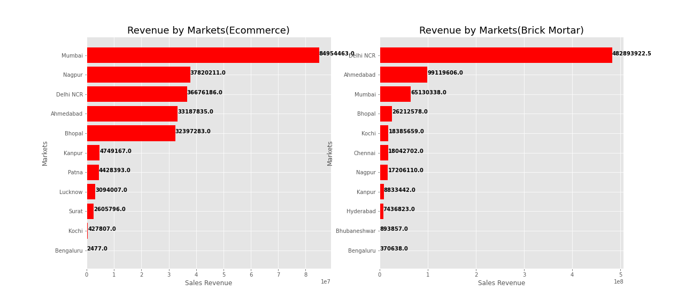
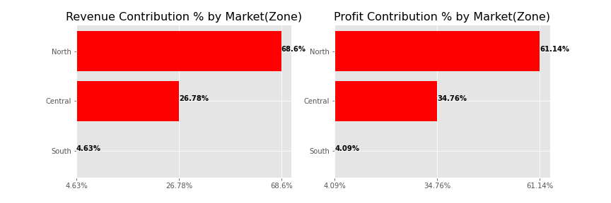
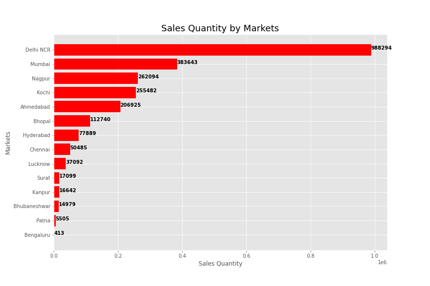
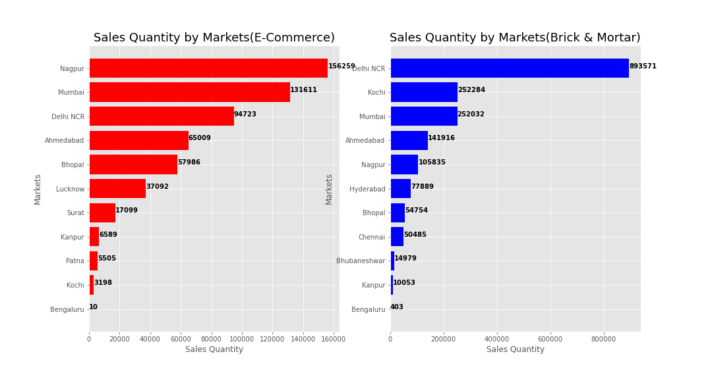
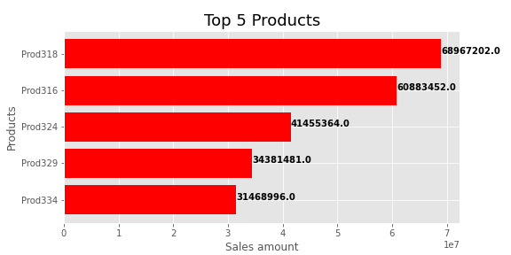
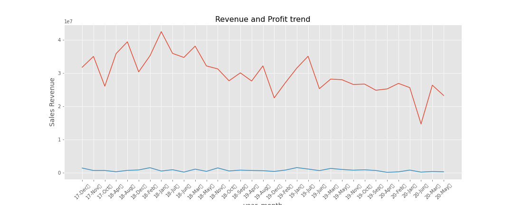
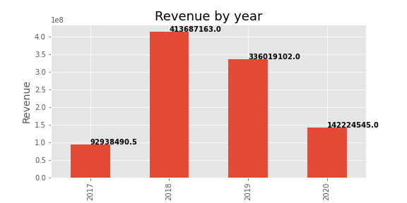

# Sales-Insights-Analysis-

## Businesss Problem
**Atliq Hardware** is a company which supplies computer hardwares and peripherals to many of the clients across the India and is headquartered in Delhi, India. They have a lot of regional offices throughout the india. The issues of tracking the sales dynamically in the dynamically growing markets have lead us to set out to justify thsese divestment by trhough analysis. Through this analysis we find insights on various markets, customeers, products, revenue, profits etc.  

## Data and Method
The data for this project was made available by <a link="https://github.com/codebasics/DataAnalysisProjects/tree/master/1_SalesInsights">codebasic</a> in the form of *sqldump* in his github. I loaded this sqldump file to **MySQL** database. Exporting data tables from MySQL workbench caused problems like rows limit and delay in exporting. To deal with this issues, I used **python** to connect to the database and collect all datas.  
After collecting the data we used python packages like pandas, matplotlib, seaborn etc for comphrensive analysis.  

## Business Questions
#### 1. How much of Total Revenue generated?  
The total revenue generated till now: **984869300.5** INR  

#### 2. How much of total Profit is made?
The total profit made till now: **24657068.41** INR

#### 3. How much of product Quantities are sold?
The total sales quantities till now:  **2429282** units

#### 4. which markets have the highest Revenue contributions?
  
The top 5 market areas with highest revenue contributions are: Delhi NCR(52.8%), Mumbai(15.2%), Ahmedabad(13.4%), Bhopal(6.0%) and Nagpur(5.6%).  
   
#### 5. what are top 3 markets by customers type based on Revenue?
  
Top 3 markets by E-Commerce are: Mumbai, Nagpur and Delhi NCR. Whereas Top 3 markets by Brick & Mortars are: Delhi NCR, Ahmedabad and Mumbai.  

#### 6. How does zone contributes to Revenue and Profits?  
  
More than 2 quarter of the revenues(68.6%) and profit(61.4%) is contributed by Northern zone followed by Central zone(revenue:26.78% and profit:34.76%) and Southern zone(revenue:4.63% and profit:4.09%)

#### 7. Which are the markets with highest and lowest profit contributions?  
  
Delhi NCR, Ahmedabad and Mumbai are 3 highest profit contributers. Similiarly, we can Kanpur and Bengaluru have negative profits which indicates loss. Note: numbers are in percent(%)  

#### 8. Which are the top markets based on sale quantities?  
  
Delhi NcR, Mumbai and Nagpurare the maarkets with highest units sold. Whereas Bengaluru, Patna and Bhubaneshwar are markets with lowest units sold.

#### 9. Which are the top markets with highest sale quantities based on customer type?  
  
The top 3 markets with highest sale quantities based on E_Commerce are: Mumbai, Nagpur and Delhi NCR. Similiarly, the top 3 markets with highest sales quantities based on Brick & Mortat are: Delhi NCR, Kochi and Mumbai.

#### 10. How much of the Revenyue and profits are contributed by Customers?
Note:sorted by Revenue

|custmer_name            |Revenue    |profit_margin     |Revenue Contribution %|profit margin %|
|------------------------|-----------|------------------|----------------------|---------------|
|Electricalsara Stores   |413333588.0|9307899.349999936 |41.97%                |37.75%         |
|Electricalslytical      |49644189.0 |1688259.9999999937|5.04%                 |6.85%          |
|Excel Stores            |49115620.0 |679991.1299999998 |4.99%                 |2.76%          |
|Premium Stores          |44962503.5 |1053784.0899999982|4.57%                 |4.27%          |
|Nixon                   |43893083.0 |1785811.3899999992|4.46%                 |7.24%          |
|Info Stores             |35100033.0 |314450.9500000005 |3.56%                 |1.28%          |
|Control                 |31771997.0 |825928.1000000009 |3.23%                 |3.35%          |
|Surge Stores            |28648916.0 |656033.0799999998 |2.91%                 |2.66%          |
|Acclaimed Stores        |21196727.0 |321095.179999999  |2.15%                 |1.3%           |
|Forward Stores          |21026079.0 |560788.79         |2.13%                 |2.27%          |
|Epic Stores             |18750440.0 |329118.30999999953|1.9%                  |1.33%          |
|Nomad Stores            |17739351.0 |512481.1399999991 |1.8%                  |2.08%          |
|Electricalsocity        |17489935.0 |724632.3999999993 |1.78%                 |2.94%          |
|Modular                 |17379851.0 |451681.53999999986|1.76%                 |1.83%          |
|Atlas Stores            |16666713.0 |295896.22000000044|1.69%                 |1.2%           |
|Leader                  |16529970.0 |1246643.26        |1.68%                 |5.06%          |
|Surface Stores          |15242562.0 |490678.97000000015|1.55%                 |1.99%          |
|Integration Stores      |13979716.0 |246399.69999999975|1.42%                 |1.0%           |
|Logic Stores            |13201366.0 |486810.2800000002 |1.34%                 |1.97%          |
|Path                    |12995938.0 |214153.26000000024|1.32%                 |0.87%          |
|Unity Stores            |12589257.0 |229875.50000000003|1.28%                 |0.93%          |
|Electricalsopedia Stores|10281203.0 |329932.1300000003 |1.04%                 |1.34%          |
|Flawless Stores         |9156412.0  |314032.67999999964|0.93%                 |1.27%          |
|Synthetic               |6173068.0  |87751.99          |0.63%                 |0.36%          |
|All-Out                 |6068432.0  |154729.64999999973|0.62%                 |0.63%          |
|Power                   |5727123.0  |353694.80000000005|0.58%                 |1.43%          |
|Relief                  |5230158.0  |170833.7000000001 |0.53%                 |0.69%          |
|Zone                    |5067349.0  |60753.390000000036|0.51%                 |0.25%          |
|Sound                   |4966707.0  |198905.72999999992|0.5%                  |0.81%          |
|Elite                   |4837239.0  |212317.24999999988|0.49%                 |0.86%          |
|Propel                  |4183862.0  |139303.27999999994|0.42%                 |0.56%          |
|Insight                 |3342051.0  |34610.390000000036|0.34%                 |0.14%          |
|Novus                   |2359799.0  |75340.81000000014 |0.24%                 |0.31%          |
|Sage                    |2252506.0  |34479.76          |0.23%                 |0.14%          |
|Electricalslance Stores |1868461.0  |-37486.75999999998|0.19%                 |-0.15%         |
|Electricalsquipo Stores |1330361.0  |87622.99999999997 |0.14%                 |0.36%          |
|Expression              |430368.0   |15086.28000000001 |0.04%                 |0.06%          |
|Electricalsbea Stores   |336367.0   |2747.689999999999 |0.03%                 |0.01%          |

#### 11. What are the top 5 Products based on Revenue generated?  

#### 12. Revenue and Profit trends.  
  
we can see that since 2018 Jan sales/Revenue are decreasin

#### 13. Revenues by Year
  
2016 have the highest Revenue and since than Revenue have been decreasing.  

