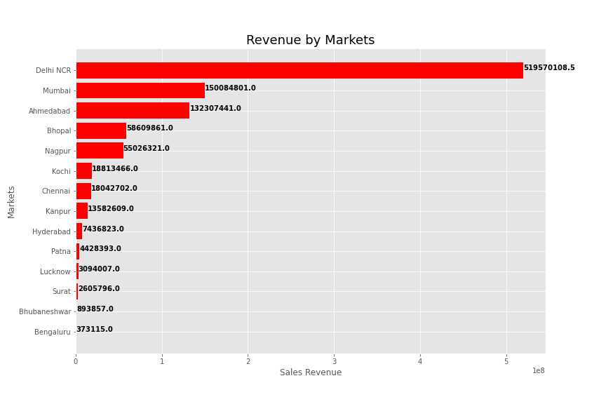

# Sales-Insights-Analysis-

## Businesss Problem
**Atliq Hardware** is a company which supplies computer hardwares and peripherals to many of the clients across the India and is headquartered in Delhi, India. They have a lot of regional offices throughout the india. The issues of tracking the sales dynamically in the dynamically growing markets have lead us to set out to justify thsese divestment by trhough analysis. Through this analysis we find insights on various markets, customeers, products, revenue, profits etc.  

## Data and Method
The data for this project was made available by <a link="https://github.com/codebasics/DataAnalysisProjects/tree/master/1_SalesInsights">codebasic</a> in the form of *sqldump* in his github. I loaded this sqldump file to **MySQL** database. Exporting data tables from MySQL workbench caused problems like rows limit and delay in exporting. To deal with this issues, I used **python** to connect to the database and collect all datas.  
After collecting the data we used python packages like pandas, matplotlib, seaborn etc for comphrensive analysis.  

## Business Questions
#### 1. How much of Total Revenue generated?  
The total revenue generated till now: **984869300.5** INR  

#### 2. How much of total Profit is made?
The total profit made till now: **24657068.41** INR

#### 3. How much of product Quantities are sold?
The total sales quantities till now:  **2429282** units

#### 4. which markets have the highest Revenue contributions?

</'center>

